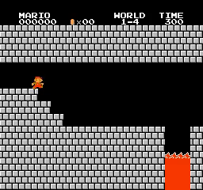
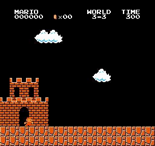
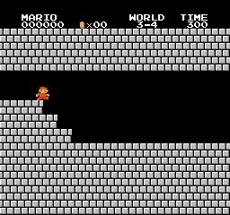
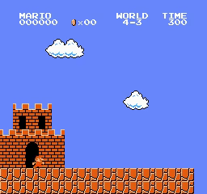
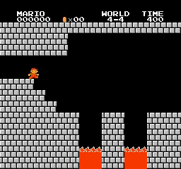
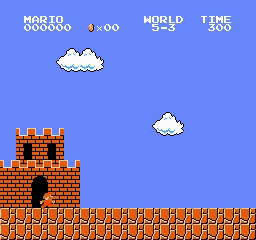
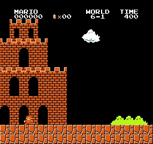
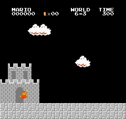

# Mario_PTR_PPO
Playing Super Mario Bros using Proximal Policy Optimization with Prioritized Trajectory Replay (PTR-PPO)

## Introduction

My PyTorch Proximal Policy Optimization with Prioritized Trajectory Replay (PTR-PPO) implement to playing Super Mario Bros. My code is modify from [PTR-PPO paper](https://arxiv.org/pdf/2112.03798). This paper combine [PPO paper](https://arxiv.org/abs/1707.06347) with [Prioritized Experience Replay paper](https://arxiv.org/pdf/1511.05952). But I couldn't find any reference code, and I don't understand some points in the paper (it’s also possible that those points in the paper aren't as good as my modifications), so I made some adjustments compared to the original paper.

Đây là code PyTorch Proximal Policy Optimization with Prioritized Trajectory Replay (PTR-PPO) để chơi Super Mario Bros của tôi. Code của tôi được điều chỉnh từ [PTR-PPO paper](https://arxiv.org/pdf/2112.03798). Paper này kết hợp [PPO paper](https://arxiv.org/abs/1707.06347) và [Prioritized Experience Replay paper](https://arxiv.org/pdf/1511.05952). Nhưng tôi không thể tìm được mã nguồn của paper và tôi không hiểu một số điểm trong paper (cũng có thể các điểm tôi không hiểu không tốt bằng thay đổi của tôi) nên tôi đã thực hiện 1 số điều chỉnh so với paper gốc.

  
  
  
   
  
  
  
   
  
  
  
   
  
  
  
   
  
  
  
   
  
  
  
   
  
  
  
   
  
  
  
   
  <i>Results</i>

