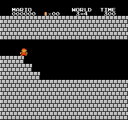

# Mario_PTR_PPO
Playing Super Mario Bros using Proximal Policy Optimization with Prioritized Trajectory Replay (PTR-PPO)

## Introduction

Đây là code PyTorch Proximal Policy Optimization with Prioritized Trajectory Replay (PTR-PPO) để chơi Super Mario Bros của tôi. Code của tôi được điều chỉnh từ [PTR-PPO paper](https://arxiv.org/pdf/2112.03798). Paper này kết hợp [PPO paper](https://arxiv.org/abs/1707.06347) và [Prioritized Experience Replay paper](https://arxiv.org/pdf/1511.05952). Nhưng tôi không thể tìm được mã nguồn của paper và tôi không hiểu một số điểm trong paper (cũng có thể các điểm tôi không hiểu không tốt bằng thay đổi của tôi) nên tôi đã thực hiện 1 số điều chỉnh so với paper gốc.

  
  
  
   
  
  
  
   
  
  
  
   
  
  
  
   
  
  
  
   
  
  
  
   
  
  
  
   
  
  
  
   
  <i>Results</i>

## Motivation

Tôi có niềm đam mê với reinformance learning và cả mario (tôi thấy mario là 1 môi trường đủ khó để test thử các thuật toán). Mục tiêu của tôi là học hỏi nhiều kiến thức và thuật toán reinformance learning hơn. Đồng thời việc implement các thuật toán này cũng giúp tôi cải thiện kỹ năng code. Tôi muốn train 1 agent có thể hoàn tất cùng lúc 32/32 level một cách dễ dàng bằng reinformance learning. Tôi đã triển khai một số thuật toán RL ([A2C](https://github.com/CVHvn/Mario_A2C), [PPO](https://github.com/CVHvn/Mario_PPO), [PPO-RND](https://github.com/CVHvn/Mario_PPO_RND)) để chơi mario và đã hoàn thành nó với PPO-RND. Tuy nhiên tôi cảm thấy các thuật toán này vẫn chưa đủ mạnh để train 32 stages cùng lúc, các thuật toán cần tinh chỉnh siêu tham số để hoàn thành các stages khó (dù tôi đã có đủ kinh nghiệm để chọn siêu tham số cho các stage khó!). Nên tôi sẽ tiếp tục tìm hiểu và triển khai các thuật toán RL nâng cao hơn. Theo kinh nghiệm của tôi, các thuật toán off-policy cho kết quả rất tệ khi huấn luyện agent chơi ppo. Tuy nhiên tôi vẫn thích ý tưởng về Experience Replay, tôi nghĩ nó sẽ giúp improve các thuật toán on-policy như PPO (kết hợp on-policy và off-policy). Ban đầu tôi định thử implement ACER, nhưng tôi thấy nó khó hiểu và khó code, kết quả cũng gần như tương đồng (chỉ tốt hơn 1 chút) so với PPO. Nên tôi đã quyết định tìm hiểu và thử implement PPO-PTR, cải tiến kết hợp PPO với experience replay. 

## How to use it

Bạn có thể sử dụng notebook của tôi để train và test agent rất dễ dàng:
* **Để train agent**, chỉ cần run tất cả cell trước session test
* **Để test agent**, chỉ cần run tất cả cell trừ cell agent.train() và thêm đường dẫn pretrained model vào agent.load_model(model_path)

Hoặc bạn có thể dùng **train.py** và **test.py** nếu bạn không muốn dùng notebook:
* **Để train agent**, run file **train.py**: ví dụ để training stage 1-4: python train.py --world 1 --stage 4 --num_envs 8
* **Test your trained model**, run file **test.py**: ví dụ để testing for stage 1-4: python test.py --world 1 --stage 4 --pretrained_model best_model.pth --num_envs 2

## Trained models

Bạn có thể sử dụng các model đã được tôi huấn luyện tại folder [trained_model](trained_model)

## Hyperparameters

Tôi chọn siêu tham số dựa trên các tham số mặc định của PPO, PER và paper PPO-PTR:
- Với PER: alpha = 0.7, eps = 0.01 như [Howuhh PER](https://github.com/Howuhh/prioritized_experience_replay/blob/main/memory/buffer.py). Thuật toán này không dùng tham số beta vì chúng ta sẽ đánh trọng số bằng importance sampling thay vì PER weight được tính bằng priority và beta.
- Memory size = 256. Tôi đã thử 256, 512 và 1024. Tôi thấy 256 work tốt hơn.
- eps_marg = 0.2 giống như paper PPO-PTR.
- Tỷ lệ của on-policy và off-policy là 2:8 như paper PPO-PTR.
- Tôi giữ nguyên gamma cho các stages dựa theo siêu tham số từ project PPO của tôi: 0.9 hoặc 0.99
- Tôi chỉ tuning batchsize cho stage 8-1 và 8-4: dùng 256 thay vì 64
- Tôi vẫn dùng entropy target = 0.05, tôi tin rằng đây là tham số quan trọng giúp ổn định việc học. Lưu ý: Tôi tính entropy target với old_policy được backup trước khi train thay vì behavior policy.
- Bộ tham số mặc định (trừ gamma) đã work với 30/32 stages, vì hạn chế về resource, tôi không thể chỉ thử với 1 gamma duy nhất mà cần tham khảo từ các project cũ (các stage không thể hoàn thành với 0.9 thì thử 0.99) 

Bạn có thể tham khảo siêu tham số ở bảng bên dưới.

| World | Stage | num_envs | learn_step | batchsize | on-epoch | off-epoch | lambda | gamma | learning_rate | target_kl | clip_param | max_grad_norm | norm_adv | V_coef | entropy_coef | loss_type | per_eps | per_alpha | per_beta | eps_marg | memory_size | training_step | training_time |
|-------|-------|----------|------------|-----------|----------|-----------|--------|-------|---------------|-----------|------------|---------------|----------|--------|--------------|-----------|---------|------------|----------|-----------|--------------|---------------|---------------|
| 1     | 1     | 16       | 512        | 64        | 2        | 8         | 0.95   | 0.9   | 7e-5      | 0.05      | 0.2        | 0.5           | FALSE    | 0.5    | 0.01         | huber     | 0.01    | 0.7        | 0.4      | 0.2       | 256          | 104954        | 4:07:44       |
| 1     | 2     | 16       | 512        | 64        | 2        | 8         | 0.95   | 0.9   | 7e-5      | 0.05      | 0.2        | 0.5           | FALSE    | 0.5    | 0.01         | huber     | 0.01    | 0.7        | 0.4      | 0.2       | 256          | 337885        | 15:52:13      |
| 1     | 3     | 16       | 512        | 64        | 2        | 8         | 0.95   | 0.99  | 7e-5      | 0.05      | 0.2        | 0.5           | FALSE    | 0.5    | 0.01         | huber     | 0.01    | 0.7        | 0.4      | 0.2       | 256          | 533502        | 22:06:32      |
| 1     | 4     | 16       | 512        | 64        | 2        | 8         | 0.95   | 0.9   | 7e-5      | 0.05      | 0.2        | 0.5           | FALSE    | 0.5    | 0.01         | huber     | 0.01    | 0.7        | 0.4      | 0.2       | 256          | 46076         | 1:57:32       |
| 2     | 1     | 16       | 512        | 64        | 2        | 8         | 0.95   | 0.9   | 7e-5      | 0.05      | 0.2        | 0.5           | FALSE    | 0.5    | 0.01         | huber     | 0.01    | 0.7        | 0.4      | 0.2       | 256          | 415724        | 15:06:07      |
| 2     | 2     | 16       | 512        | 64        | 2        | 8         | 0.95   | 0.9   | 7e-5      | 0.05      | 0.2        | 0.5           | FALSE    | 0.5    | 0.01         | huber     | 0.01    | 0.7        | 0.4      | 0.2       | 256          | 497663        | 17:39:54      |
| 2     | 3     | 16       | 512        | 64        | 2        | 8         | 0.95   | 0.9   | 7e-5      | 0.05      | 0.2        | 0.5           | FALSE    | 0.5    | 0.01         | huber     | 0.01    | 0.7        | 0.4      | 0.2       | 256          | 120297        | 4:34:15       |
| 2     | 4     | 16       | 512        | 64        | 2        | 8         | 0.95   | 0.9   | 7e-5      | 0.05      | 0.2        | 0.5           | FALSE    | 0.5    | 0.01         | huber     | 0.01    | 0.7        | 0.4      | 0.2       | 256          | 86015         | 3:31:16       |
| 3     | 1     | 16       | 512        | 64        | 2        | 8         | 0.95   | 0.9   | 7e-5      | 0.05      | 0.2        | 0.5           | FALSE    | 0.5    | 0.01         | huber     | 0.01    | 0.7        | 0.4      | 0.2       | 256          | 126464        | 4:33:51       |
| 3     | 2     | 16       | 512        | 64        | 2        | 8         | 0.95   | 0.9   | 7e-5      | 0.05      | 0.2        | 0.5           | FALSE    | 0.5    | 0.01         | huber     | 0.01    | 0.7        | 0.4      | 0.2       | 256          | 67053         | 3:02:46       |
| 3     | 3     | 16       | 512        | 64        | 2        | 8         | 0.95   | 0.99  | 7e-5      | 0.05      | 0.2        | 0.5           | FALSE    | 0.5    | 0.01         | huber     | 0.01    | 0.7        | 0.4      | 0.2       | 256          | 138742        | 4:04:53       |
| 3     | 4     | 16       | 512        | 64        | 2        | 8         | 0.95   | 0.99  | 7e-5      | 0.05      | 0.2        | 0.5           | FALSE    | 0.5    | 0.01         | huber     | 0.01    | 0.7        | 0.4      | 0.2       | 256          | 106495        | 3:11:51       |
| 4     | 1     | 16       | 512        | 64        | 2        | 8         | 0.95   | 0.9   | 7e-5      | 0.05      | 0.2        | 0.5           | FALSE    | 0.5    | 0.01         | huber     | 0.01    | 0.7        | 0.4      | 0.2       | 256          | 134124        | 3:55:59       |
| 4     | 2     | 16       | 512        | 64        | 2        | 8         | 0.95   | 0.99  | 7e-5      | 0.05      | 0.2        | 0.5           | FALSE    | 0.5    | 0.01         | huber     | 0.01    | 0.7        | 0.4      | 0.2       | 256          | 436208        | 15:47:05      |
| 4     | 3     | 16       | 512        | 64        | 2        | 8         | 0.95   | 0.99  | 7e-5      | 0.05      | 0.2        | 0.5           | FALSE    | 0.5    | 0.01         | huber     | 0.01    | 0.7        | 0.4      | 0.2       | 256          | 106484        | 4:21:14       |
| 4     | 4     | 16       | 512        | 64        | 2        | 8         | 0.95   | 0.99  | 7e-5      | 0.05      | 0.2        | 0.5           | FALSE    | 0.5    | 0.01         | huber     | 0.01    | 0.7        | 0.4      | 0.2       | 256          | 219638        | 7:33:17       |
| 5     | 1     | 16       | 512        | 64        | 2        | 8         | 0.95   | 0.9   | 7e-5      | 0.05      | 0.2        | 0.5           | FALSE    | 0.5    | 0.01         | huber     | 0.01    | 0.7        | 0.4      | 0.2       | 256          | 156160        | 5:47:13       |
| 5     | 2     | 16       | 512        | 64        | 2        | 8         | 0.95   | 0.9   | 7e-5      | 0.05      | 0.2        | 0.5           | FALSE    | 0.5    | 0.01         | huber     | 0.01    | 0.7        | 0.4      | 0.2       | 256          | 326645        | 9:55:26       |
| 5     | 3     | 16       | 512        | 64        | 2        | 8         | 0.95   | 0.99  | 7e-5      | 0.05      | 0.2        | 0.5           | FALSE    | 0.5    | 0.01         | huber     | 0.01    | 0.7        | 0.4      | 0.2       | 256          | 214010        | 8:17:16       |
| 5     | 4     | 16       | 512        | 64        | 2        | 8         | 0.95   | 0.99  | 7e-5      | 0.05      | 0.2        | 0.5           | FALSE    | 0.5    | 0.01         | huber     | 0.01    | 0.7        | 0.4      | 0.2       | 256          | 205299        | 6:57:02       |
| 6     | 1     | 16       | 512        | 64        | 2        | 8         | 0.95   | 0.9   | 7e-5      | 0.05      | 0.2        | 0.5           | FALSE    | 0.5    | 0.01         | huber     | 0.01    | 0.7        | 0.4      | 0.2       | 256          | 72187         | 3:01:48       |
| 6     | 2     | 16       | 512        | 64        | 2        | 8         | 0.95   | 0.9   | 7e-5      | 0.05      | 0.2        | 0.5           | FALSE    | 0.5    | 0.01         | huber     | 0.01    | 0.7        | 0.4      | 0.2       | 256          | 367614        | 14:29:09      |
| 6     | 3     | 16       | 512        | 64        | 2        | 8         | 0.95   | 0.99  | 7e-5      | 0.05      | 0.2        | 0.5           | FALSE    | 0.5    | 0.01         | huber     | 0.01    | 0.7        | 0.4      | 0.2       | 256          | 158714        | 6:11:25       |
| 6     | 4     | 16       | 512        | 64        | 2        | 8         | 0.95   | 0.99  | 7e-5      | 0.05      | 0.2        | 0.5           | FALSE    | 0.5    | 0.01         | huber     | 0.01    | 0.7        | 0.4      | 0.2       | 256          | 137216        | 5:22:12       |
| 7     | 1     | 16       | 512        | 64        | 2        | 8         | 0.95   | 0.9   | 7e-5      | 0.05      | 0.2        | 0.5           | FALSE    | 0.5    | 0.01         | huber     | 0.01    | 0.7        | 0.4      | 0.2       | 256          | 179706        | 7:05:49       |
| 7     | 2     | 16       | 512        | 64        | 2        | 8         | 0.95   | 0.9   | 7e-5      | 0.05      | 0.2        | 0.5           | FALSE    | 0.5    | 0.01         | huber     | 0.01    | 0.7        | 0.4      | 0.2       | 256          | 595449        | 16:05:53      |
| 7     | 3     | 16       | 512        | 64        | 2        | 8         | 0.95   | 0.9   | 7e-5      | 0.05      | 0.2        | 0.5           | FALSE    | 0.5    | 0.01         | huber     | 0.01    | 0.7        | 0.4      | 0.2       | 256          | 217597        | 7:54:26       |
| 7     | 4     | 16       | 512        | 64        | 2        | 8         | 0.95   | 0.99  | 7e-5      | 0.05      | 0.2        | 0.5           | FALSE    | 0.5    | 0.01         | huber     | 0.01    | 0.7        | 0.4      | 0.2       | 256          | 120787        | 4:52:59       |
| 8     | 1     | 16       | 512        | 256       | 2        | 8         | 0.95   | 0.9   | 7e-5      | 0.05      | 0.2        | 0.5           | FALSE    | 0.5    | 0.01         | huber     | 0.01    | 0.7        | 0.4      | 0.2       | 256          | 2455542       | 3 days, 19:55:54  |
| 8     | 2     | 16       | 512        | 64        | 2        | 8         | 0.95   | 0.9   | 7e-5      | 0.05      | 0.2        | 0.5           | FALSE    | 0.5    | 0.01         | huber     | 0.01    | 0.7        | 0.4      | 0.2       | 256          | 759799        | 21:39:34      |
| 8     | 3     | 16       | 512        | 64        | 2        | 8         | 0.95   | 0.9   | 7e-5      | 0.05      | 0.2        | 0.5           | FALSE    | 0.5    | 0.01         | huber     | 0.01    | 0.7        | 0.4      | 0.2       | 256          | 263168        | 9:13:53       |
| 8     | 4     | 16       | 512        | 256       | 2        | 8         | 0.95   | 0.99  | 7e-5      | 0.05      | 0.2        | 0.5           | FALSE    | 0.5    | 0.01         | huber     | 0.01    | 0.7        | 0.4      | 0.2       | 256          | 1532832       | 2 days, 12:02:26  |

## Questions

* Code của tôi có đảm bảo hoàn tất tất cả các stages không?
  - Siêu tham số của tôi không đảm bảo hoàn tất các stage, nhưng trừ stage 8-1 và stage 8-4 thì tôi hoàn thành tất cả stage còn lại chỉ với 1 lần training. Update: các stage 1-3, 5-3, 8-1, 8-4 sẽ có thể tốn nhiều step hơn để hoàn thành khi tôi thử lại với siêu tham số khác (tôi đã rất may mắn với lần chạy đầu tiên).
  - Stage 8-1 tôi phải chỉnh thử 3 siêu tham số (batchsize 64 + gamma 0.9, batchsize 64 + gamma 0.99, batchsize 256 + gamma 0.9) và tôi hoàn thành với siêu tham số cuối cùng (batchsize 256 + gamma 0.9). Tôi không train nhiều lần nên không chắc về tỷ lệ huấn luyện thành công. Nhưng với kinh nghiệm của tôi với các thuật toán RL khác, tôi nghĩ tỷ lệ thành công rất cao, nếu bạn không quá xui thì chắc chắn sẽ thành công ngay lần đầu!.
  - Stage 8-4 gần như không thể hoàn thành trừ khi bạn may mắn. Tôi đã thử nhiều siêu tham số và run nhiều lần với mỗi bộ siêu tham số. Tôi đã may mắn khi mario học được cách thực hiện double jump (hack game?). Nếu bạn train lại, tôi nghĩ bạn sẽ không thể hoàn thành stage 8-4.

* Thời gian để train agent?
  - Từ vài giờ đến vài ngày. Tùy theo phần cứng, tôi dùng nhiều phần cứng khác nhau trong quá trình training và train nhiều agent cùng lúc nên tốc độ bị ảnh hưởng. Bạn có thể tham khảo trong bảng ở phần **Hyperparameters**

* Bạn có thể làm gì để cải thiện code của tôi?
  - Bạn có thể tách phần testing ra thành 1 thread hoặc process riêng. Tôi không giỏi code đa lường nên tôi không làm vậy!
  - Bạn có thể thử các bộ siêu tham số khác!

* So sánh với PPO?
  - Tôi thấy thuật toán ổn định hơn PPO, hoàn tất 30/32 stages trong lần 1 lần run duy nhất.
  - Có thể hoàn tất stage 8-4 (dù may mắn). Tôi đã thử PPO với nhiều bộ siêu tham số nhưng không thể hoàn thành!
  - Thuật toán này chậm hơn và tốn nhiều ram hơn PPO vì dùng replay và phải lấy dữ liệu từ replay cũng như tính toán lại advantages cho dữ liệu từ replay.
  - Thuật toán cũng giới thiệu rất nhiều siêu tham số mới, nhiều siêu tham số quan trọng như alpha của PER thậm chí không được nói đến trong paper (paper thiếu chuyên nghiệp!). Dẫn đến bạn phải tuning siêu tham số nhiều hơn! 

* Tôi đã điều chỉnh gì so với paper?
  - Paper train critic network với 1 step td error. Tôi sử dụng value loss tương tự như code PPO của tôi.
  - Vì tác giả sử dụng 1 step td error, họ sẽ chỉ đánh weight sample đó bằng action_prob / old_action_prob. Tôi dùng ρ marg để weight các sample tương tự như actor loss.
  - Tác giả không nói rõ về siêu tham số alpha của PER nên tôi dùng tham số khuyến nghị là 0.7. Tác giả cũng không nói rõ về cách random sample từ PER nên tôi giữ nguyên như PER nguyên bản.
  - Trong paper, tác giả sử dụng ký hiệu b để chỉ behavior policy (save vào replay) và old_pi để chỉ policy trước khi train, pi là policy đang train (vì agent được train qua nhiều batch và epoch nên old_pi sẽ khác pi). Trong paper không nói rõ về ratio của PPO r = pi / old_pi hay r = pi / b nhưng theo lý thuyết PPO và thực nghiệm của tôi thì thuật toán chỉ work khi r = pi / b.
  - Với thuật toán trong paper, tác giả backup old_pi trước mỗi lần trainning với data được lấy từ replay. Nhưng tôi thấy việc này không ổn định, tôi chỉ backup old_pi trước mỗi lần train và chỉ update old_pi khi tới lần train tiếp theo (old_pi sẽ được backup và giữ nguyên trước khi train 2 epochs on-policy và 8 epochs off-policy)

## Acknowledgements
Tôi đã hoàn thành 32/32 stages của Super Mario Bros với thuật toán này.

## Requirements

* **python 3>3.6**
* **gym==0.25.2**
* **gym-super-mario-bros==7.4.0**
* **imageio**
* **imageio-ffmpeg**
* **cv2**
* **pytorch** 
* **numpy**

## Reference
* [Howuhh PER](https://github.com/Howuhh/prioritized_experience_replay/blob/main/memory/buffer.py)
* [CVHvn A2C](https://github.com/CVHvn/Mario_A2C)
* [Stable-baseline3 ppo](https://stable-baselines3.readthedocs.io/en/master/_modules/stable_baselines3/ppo/ppo.html#PPO)
* [uvipen PPO](https://github.com/uvipen/Super-mario-bros-PPO-pytorch)
* [lazyprogrammer A2C](https://github.com/lazyprogrammer/machine_learning_examples/tree/master/rl3/a2c)